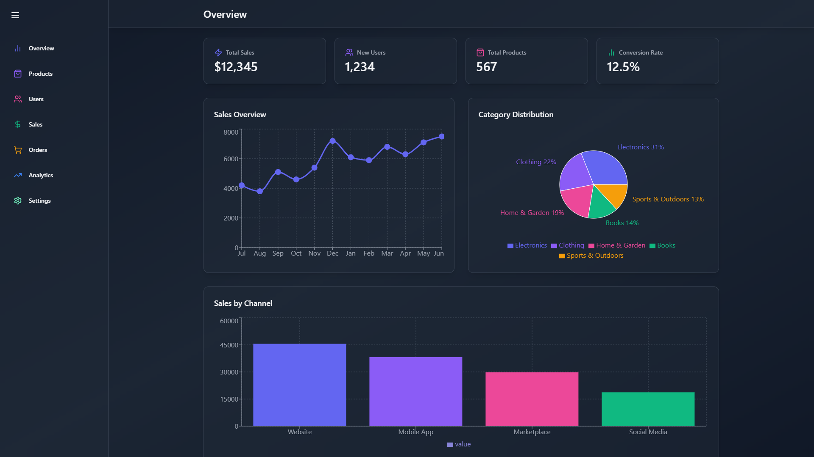
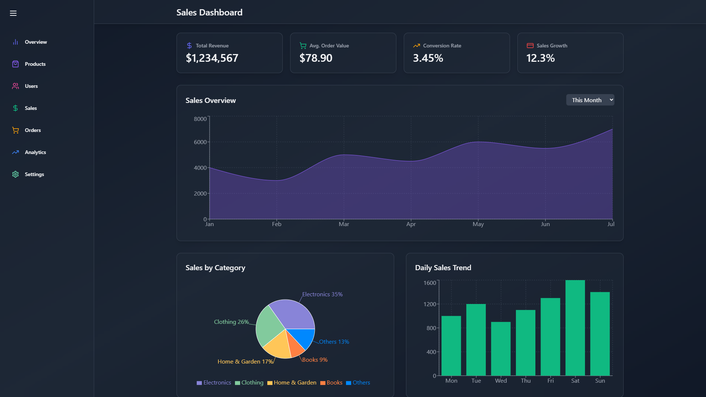
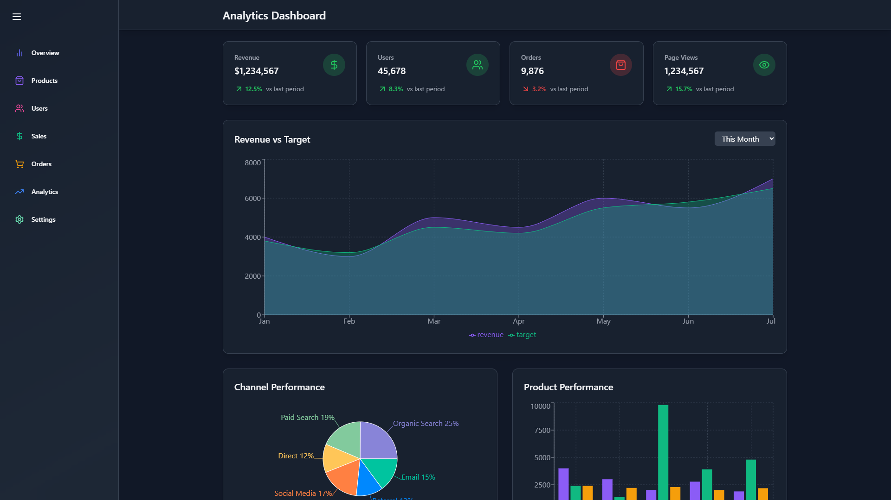
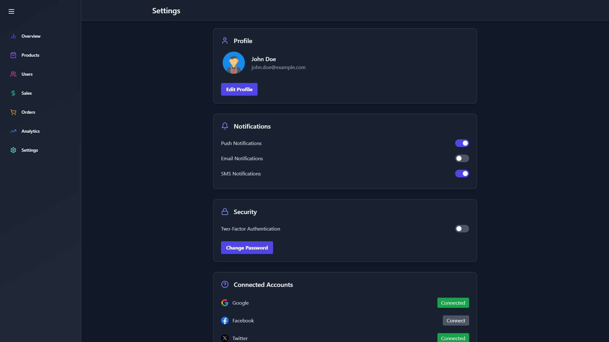

<div align="center">

# Admin Dashboard

### Modern Analytics and Management Workspace

A polished single-page admin dashboard built for monitoring products, users, sales, orders, analytics, and account settings through animated KPI cards, interactive charts, clean data tables, and a responsive dark UI.

[](https://admin-dashboard-smrid.vercel.app/)
[](https://react.dev/)
[](https://vitejs.dev/)
[](https://tailwindcss.com/)
[](https://admin-dashboard-smrid.vercel.app/)

</div>

---

## Preview

<p align="center">
  
</p>

<p align="center">
  
</p>

<p align="center">
  
</p>

<p align="center">
  
</p>

> **Live Site:** [https://admin-dashboard-smrid.vercel.app/](https://admin-dashboard-smrid.vercel.app/)

---

## Features

| Feature | Description |
| :--- | :--- |
| **Collapsible Sidebar Navigation** | Animated sidebar with quick access to Overview, Products, Users, Sales, Orders, Analytics, and Settings |
| **Overview Dashboard** | KPI summary cards with sales, users, product totals, conversion rate, and high-level charts |
| **Product Insights** | Product performance stats, inventory-style table, and supporting trend visualizations |
| **User Monitoring** | User table, growth chart, heatmap activity view, and demographic breakdown |
| **Sales Dashboard** | Revenue-focused summary cards with monthly performance and category-based charts |
| **Order Tracking** | Order metrics, daily order trends, distribution visualization, and a detailed order table |
| **Advanced Analytics** | Dedicated analytics page with revenue, retention, segmentation, channel performance, and AI-style insights panels |
| **Settings Workspace** | Editable profile section, notification toggles, security controls, connected accounts, and danger zone actions |
| **Motion-Rich Interface** | Smooth transitions and micro-animations powered by Framer Motion |
| **Responsive Layout** | Optimized dashboard experience across desktop, tablet, and smaller screens |

---

## Tech Stack

<div align="center">

| Technology | Purpose |
| :---: | :---: |
| **React 18** | Component-driven UI architecture |
| **React Router DOM** | Client-side routing between dashboard modules |
| **Vite 8** | Fast development server and optimized production bundling |
| **Tailwind CSS 3** | Utility-first styling for layout, spacing, and theming |
| **Framer Motion** | Sidebar transitions and animated UI sections |
| **Recharts** | Data visualizations across overview, sales, users, orders, and analytics pages |
| **Lucide React** | Consistent dashboard iconography |
| **ESLint** | Code quality and linting rules |
| **Vercel** | Deployment and hosting |

</div>

---

## Getting Started

### Prerequisites

- **Node.js** `v20.19+` or `v22.12+`
- **npm** `v10+`

### Installation

1. **Clone the repository**

   ```bash
   git clone <your-repository-url>
   cd admin-dashboard
   ```

2. **Install dependencies**

   ```bash
   npm install
   ```

3. **Start the development server**

   ```bash
   npm run dev
   ```

4. **Open in your browser**

   Visit `http://localhost:5173`

### Build for Production

```bash
npm run build
```

### Lint the Project

```bash
npm run lint
```

### Preview the Production Build

```bash
npm run preview
```

---

## Project Structure

```text
admin-dashboard/
|-- public/
|   |-- facebook.svg
|   |-- google.png
|   |-- preview1.png
|   |-- preview2.png
|   |-- preview3.png
|   |-- preview4.png
|   |-- vite.svg
|   `-- x.png
|-- src/
|   |-- components/
|   |   |-- analytics/
|   |   |-- common/
|   |   |-- orders/
|   |   |-- overview/
|   |   |-- products/
|   |   |-- sales/
|   |   |-- settings/
|   |   `-- users/
|   |-- pages/
|   |   |-- AnalyticsPage.jsx
|   |   |-- OrdersPage.jsx
|   |   |-- OverviewPage.jsx
|   |   |-- ProductsPage.jsx
|   |   |-- SalesPage.jsx
|   |   |-- SettingsPage.jsx
|   |   `-- UsersPage.jsx
|   |-- App.jsx
|   |-- index.css
|   `-- main.jsx
|-- index.html
|-- package.json
|-- package-lock.json
|-- postcss.config.js
|-- tailwind.config.js
|-- vite.config.js
`-- README.md
```

---

## Dashboard Modules

- **Overview:** High-level business KPIs, sales trend charts, category breakdown, and channel distribution
- **Products:** Product stats, table listing, trend analysis, and category visualization
- **Users:** User growth, activity monitoring, demographic insights, and user table management
- **Sales:** Revenue snapshots, sales overview, category mix, and daily sales trends
- **Orders:** Order volume, status distribution, daily activity, and tabular order tracking
- **Analytics:** Revenue analysis, retention, segmentation, channel comparison, and insight cards
- **Settings:** Profile editing, notification preferences, security options, connected accounts, and account actions

---

## Design Highlights

- **Dark glassmorphism-inspired UI** with layered gradients, soft borders, and subtle transparency
- **Animated stat cards and sections** for a more polished dashboard feel
- **Reusable chart and table components** grouped by domain for cleaner maintenance
- **Color-coded metrics and iconography** to make each module easier to scan quickly
- **Centralized route-based layout** with a shared sidebar and page header pattern

---

## Data Notes

This project currently uses locally defined mock data within the component files for dashboard cards, charts, tables, and settings modules. That makes it a strong UI foundation for later integration with a real API, database, or admin backend.

---

## Deployment

The application is deployed on **Vercel**.

**Live URL:** [https://admin-dashboard-smrid.vercel.app/](https://admin-dashboard-smrid.vercel.app/)

---

<div align="center">

**If this project helped you, consider giving it a star.**

Built with React, Vite, Tailwind CSS, Framer Motion, Recharts, and Lucide React.

</div>
